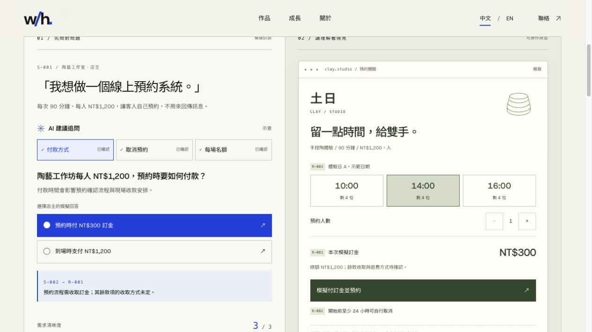
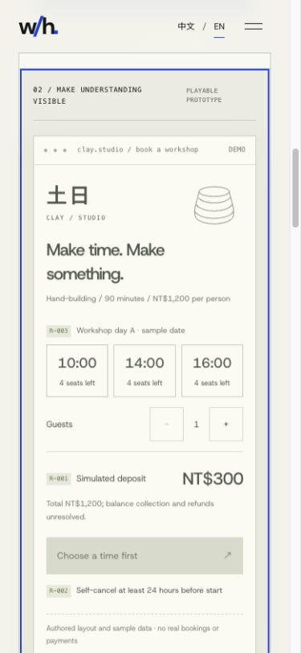

# Beachcomber — implementation and verification

Verified 2026-10-09 in the existing portfolio checkout. Existing restaurant edits were preserved; no dependency changes or commits were made.

## Delivered

- `/zh/projects/beachcomber/` and `/en/projects/beachcomber/`, plus homepage cover, case link and direct demo link.
- One authored ceramics booking scenario. Three questions, each with two answers; 8 complete rule combinations. No scenario-selection gate, recording or simulated cloud wait.
- Question → source ID → requirement rule → playable booking. Payment changes due amount/action; capacity limits guests; cancellation is self-service at least 24h before start or requires studio contact.
- Changes invalidate the old prototype. A sample shortcut fills only missing answers. Rebuilding always restarts booking state. Full reset and booking replay are separate.
- Optional PM/UI/Engineering/QA excerpts use the same IDs, preserve unresolved requirements and include meaningful per-role details. QA payment examples adapt to capacity.
- Local state only, no API, mic, session storage, customer data or real payment. Simulation disclosed at entry and inside the output.
- User confirmed the README's 黃郁庭 attribution: requirements integration, interview scenarios/demo scripting, output review, judging video. Technical implementation attributed to the team. No award/ranking claim.

## Verification results

| Check | Result |
| --- | --- |
| `npm run typecheck` | Pass |
| `npm test` | Pass: 4 files / 22 tests (7 Beachcomber tests) |
| `npm run build` | Pass: 19 static pages; both Beachcomber locale routes generated |
| `git diff --check` | Pass |
| `npm run lint` | Not available: repository has no lint script or ESLint dependency; command reports missing script |
| Static route smoke check | 15/15 HTTP 200: entry, both homepages and all 12 localized case pages, main content present |
| Browser happy path | Manually confirmed three answers, generated, picked 14:00, increased to 2 guests: NT$600 deposit, success and 2 seats left |
| Cancellation | 12h self-cancel blocked; 48h self-cancel succeeds and releases capacity; refund policy remains unresolved |
| Alternate branch | Arrival payment NT$0 at booking / NT$1,200 on arrival; one-seat capacity disables increment; studio-contact handling does not auto-cancel or send a message |
| Change / replay / reset | Editing choices returns to blueprint; regenerate uses new rules; reset returns to 0/3; shortcut preserves an already selected arrival answer |
| Specs | All four role controls switch outputs with stable IDs; final QA excerpts verified in browser; unit tests cover 27 partial/complete configurations and cross-answer totals |
| Keyboard / focus | Enter selects answers/time and submits; generation moves focus to output; successful booking focuses H4 (DOM confirmed); native controls and visible focus outlines |
| Responsive | Desktop actual viewport 1280×720 and mobile 390×844; ZH and EN inspected, no horizontal overflow at measured widths |
| Reduced motion | CSS disables exhibit transitions/animations under `prefers-reduced-motion`; source reviewed, OS setting not changed |
| Browser console | No warnings/errors observed on final Beachcomber desktop; KeFu smoke load has no errors and one demo anchor |
| Existing portfolio | Homepage Beachcomber direct demo link followed successfully; KeFu browser smoke and all existing localized routes verified |
| External calls/secrets | New demo/model/CSS source contains no fetch, external URL, environment variable access, iframe, storage or mic calls. Did not inspect or copy source secrets |

Not verified: real user timing/comprehension (5/15/30–60 seconds remain design goals), screen-reader narration, physical touch devices, exhaustive cross-browser coverage, full behavioral regression of unrelated projects, live original backend operation. Attempted 320px viewport override was not reliably reflected by the browser; not counted as a measured pass.

## Research follow-up

[Source front end and team attribution](https://github.com/The-Beachcomber/beachcomber-fe), [backend](https://github.com/The-Beachcomber/beachcomber-be), [Hermes wrapper and prompts](https://github.com/The-Beachcomber/hackathon-hermes), and [official hackathon brief](https://www.futuremode.xyz/hackathon) informed the implementation. Exact source paths and original mock limitations are in the design document.

[Judging video](https://www.youtube.com/watch?v=ZvLAx_R2K0A) uses the name SyncFrame. Visually inspected opening problem slide (around 0:07), interview transcript (0:38), side-panel follow-up cards (0:48), clickable wardrobe HTML prototype (0:58), and workflow summary (1:17). These support the discussion → follow-up → prototype → specification story. This is visual review of selected frames, not a complete audio transcription or independent validation of backend execution. The supplied live demo returns a visible 404.

## Files

New:
- `src/components/BeachcomberDemo.tsx` — interaction and playable booking
- `src/components/beachcomber-demo.css` — scoped layout/motion/responsive rules
- `src/lib/beachcomber-demo.ts` — authored questions, rules and role specs
- `src/lib/beachcomber-demo.test.ts` — rule/consistency tests
- `src/data/beachcomber.ts` — bilingual case story and contribution
- `docs/plans/2026-10-09-beachcomber-design.md` — research, alternatives and scope
- This verification report and `beachcomber-verification/{desktop,mobile}.jpg`

Extended (preserving existing edits):
- `src/app/(site)/[lang]/projects/[slug]/page.tsx` — early demo placement, sources and TOC
- `src/components/Home.tsx` — direct demo link
- `src/components/DecisionReveal.tsx` — Beachcomber homepage cover
- `src/data/content.ts` — project registration
- `src/lib/types.ts` — project slug
- `src/lib/content.test.ts` — expected identity list

## Next useful validation

Give three unfamiliar people the page without explanation. Time their first meaningful answer and first booking, then ask what Beachcomber does and what Wally contributed. Use that evidence to trim copy or adjust controls. Add a real annotated acceptance example from the hackathon only when an artifact is supplied/verified; do not invent outcome metrics.

